# Deliverable 2
## 1. What are the server hardware specifications (virtual machine settings)?
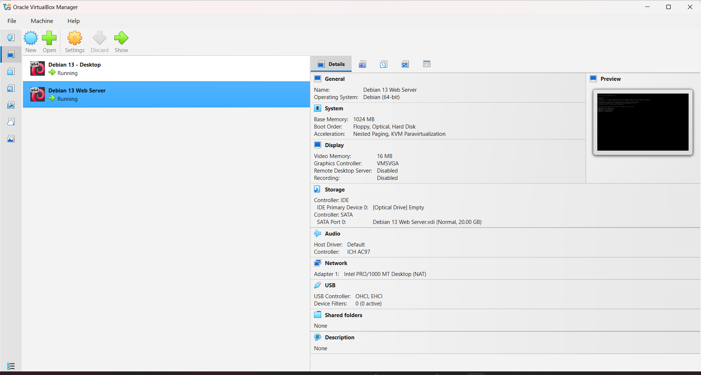

## 2. What is the Debian Login Screen?
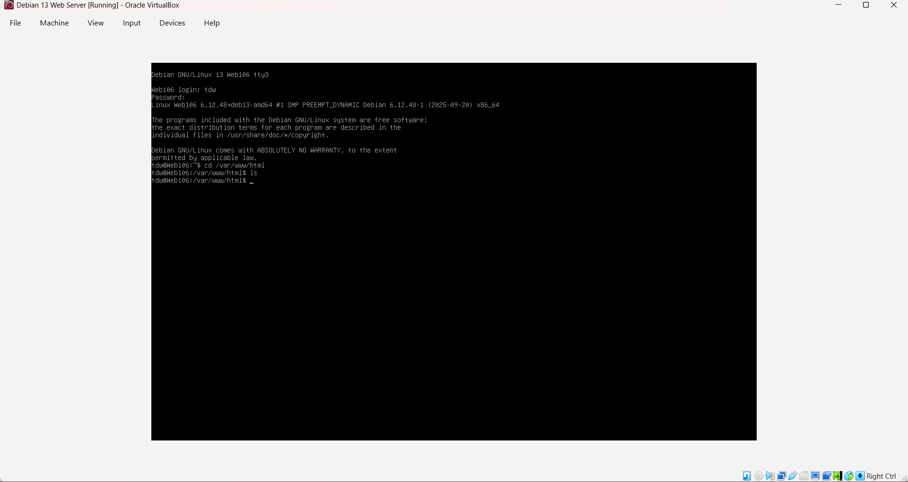

## 3. What is the IP address of your Debian Server Virtual Machine? 
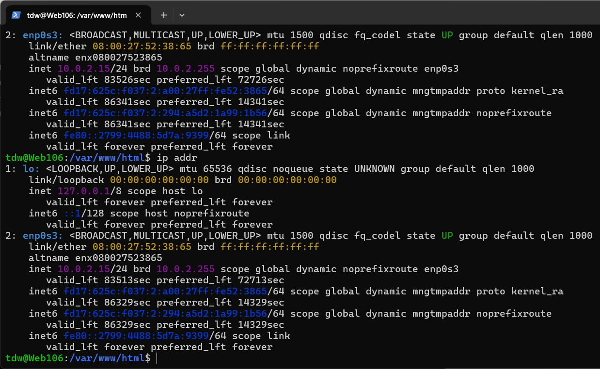

## 4. How do you work with the Firewall in Debian? **(Type and explain what each command does)**

### Command name
* **Description**: Est pariatur sint fugiat mollit ea est veniam proident nulla laboris excepteur.
* **Formula**/**Syntaxt**: `command` + `option` + `argument` 
* **Examples**:
  * How do you check if the Firewall is running?
    * By using the command `sudo ufw status`
  * How do you disable the Firewall?
    * By using the command `sudo ufw disable`
  * How do you add Apache to the Firewall?
    * By using the command `sudo ufw allow "Apache Full"`

## 5. What different commands do we use to work with Apache? **(Type the command and include a screenshot!)**

**1.  What is the command you use to check if Apache is running?**
* The command is: `sudo systemctl status apache2`
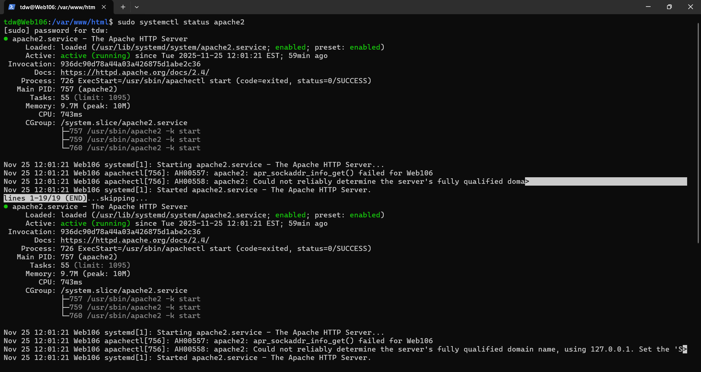

**2.  What is the command you use to stop Apache?**
* The command is: `sudo systemctl stop apache2`
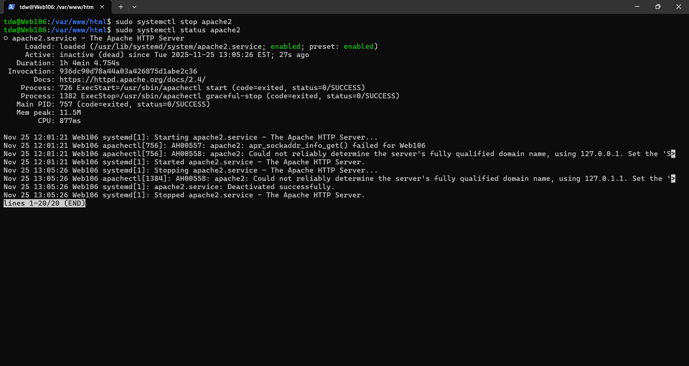

**3.  What is the command you use to restart Apache?**
* The command is: `sudo systemctl restart apache2`
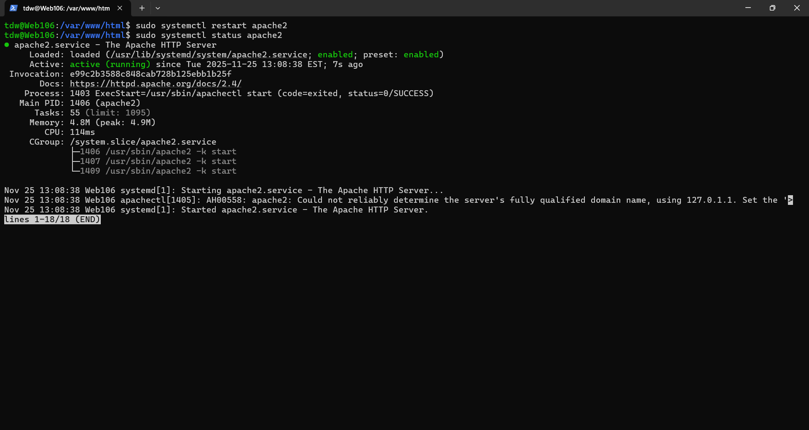

**4.  What is the command used to test Apache configuration?**
* The command is: `sudo apachectl1 -t`
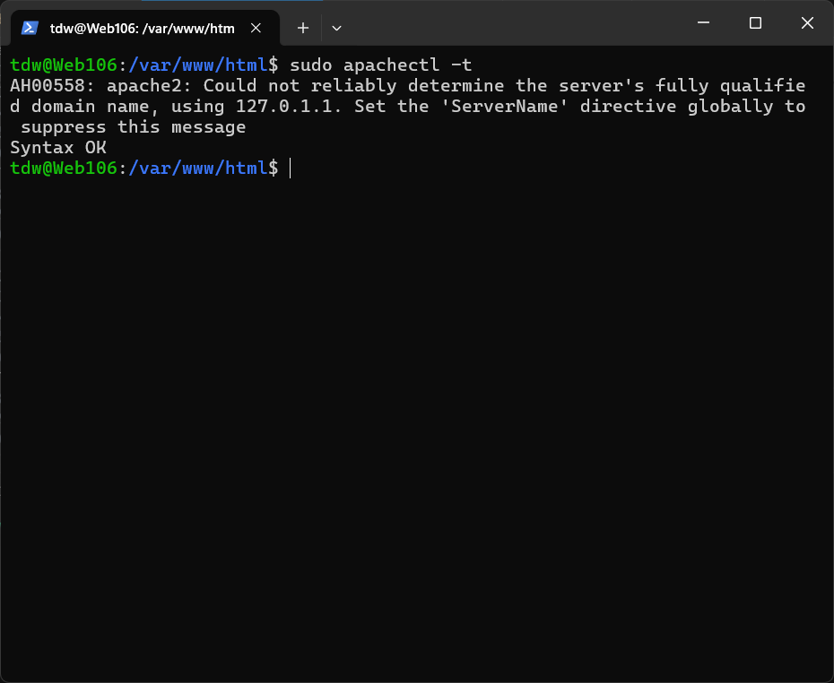

**5.  What is the command used to check the installed version of Apache?**
* The command is: `sudo apache2 -v`
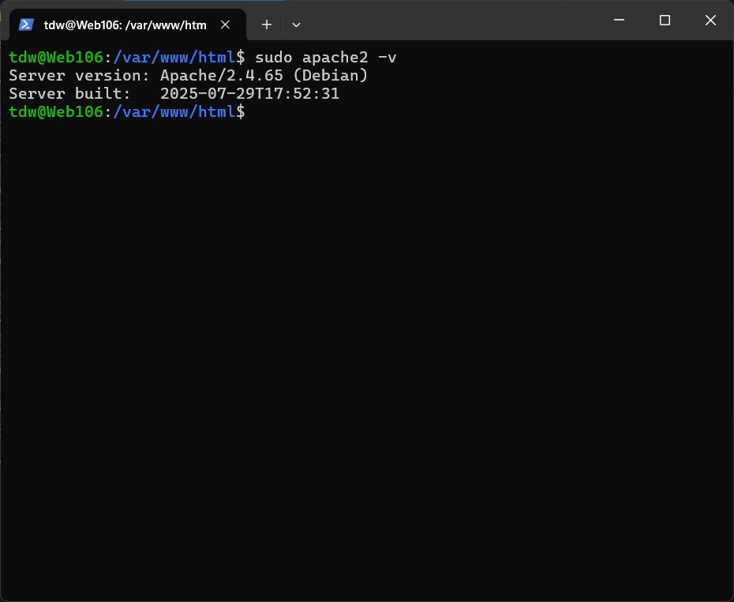

**6.  What are some common configuration files for Apache?**
* The command is: `command here`
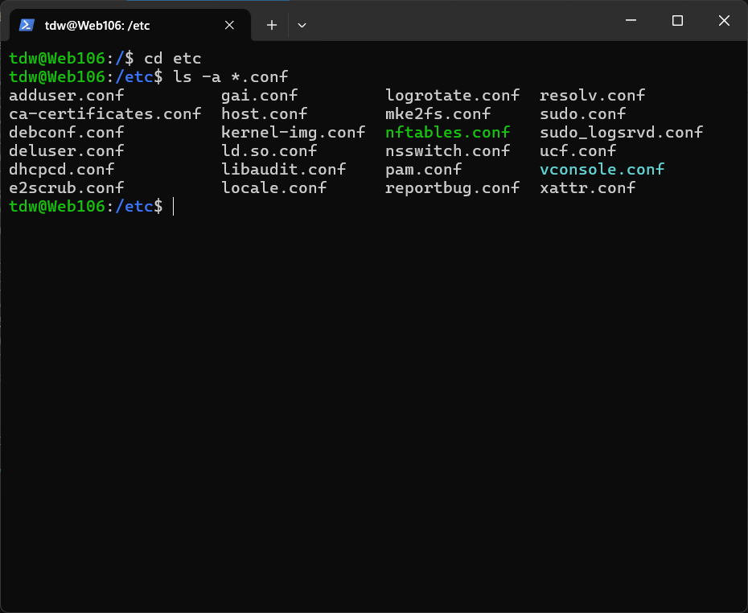

**7.  Where does Apache store logs?**
* The directory is: `do tail -n 2 /var/log/apache2/error.log`
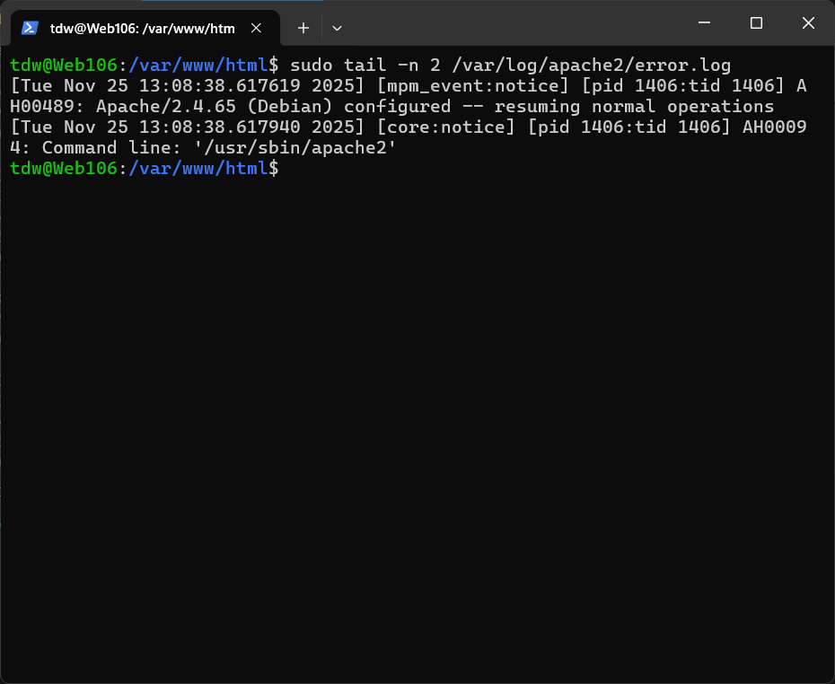

**8.  What are some basic commands we can use to review logs?**
* The command is: `sudo head -n 2 /var/log/apache2/error.log`
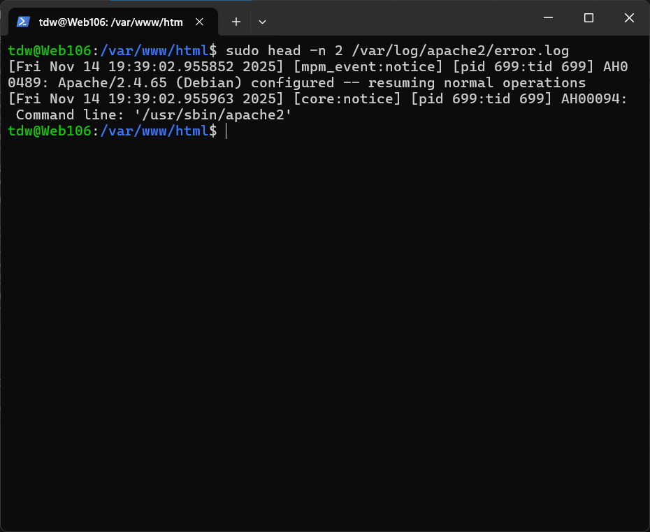

