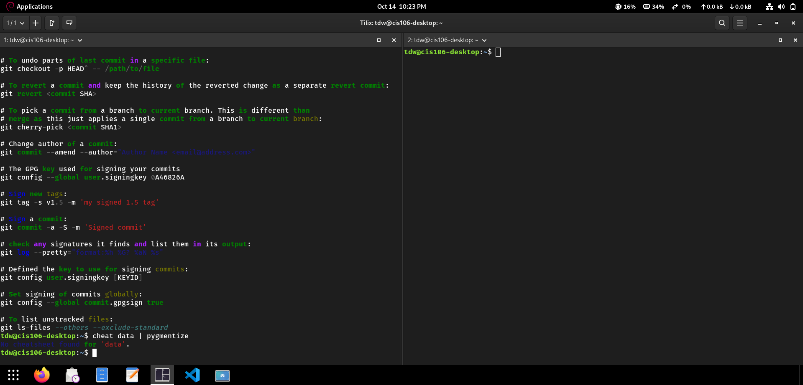

# Week Report3
## Completed work for week 3
- [lab3.md](https://github.com/TamikWilliams/cis-106/blob/main/labs/Lab3/lab3.md)
- [notes3.md](https://github.com/TamikWilliams/cis-106/blob/main/notes/notes%203/notes3.md)
- ## Practice screenshots
- ### Practice 3
- 
- 
- ### Practice 4
- 
- ### Practice 5
- 
### Practice 6
- 
- ### Practice 7
- 
- ### Practice 8
- 
- ### Practice 9
- 
- ### Practice 10
- 
- 